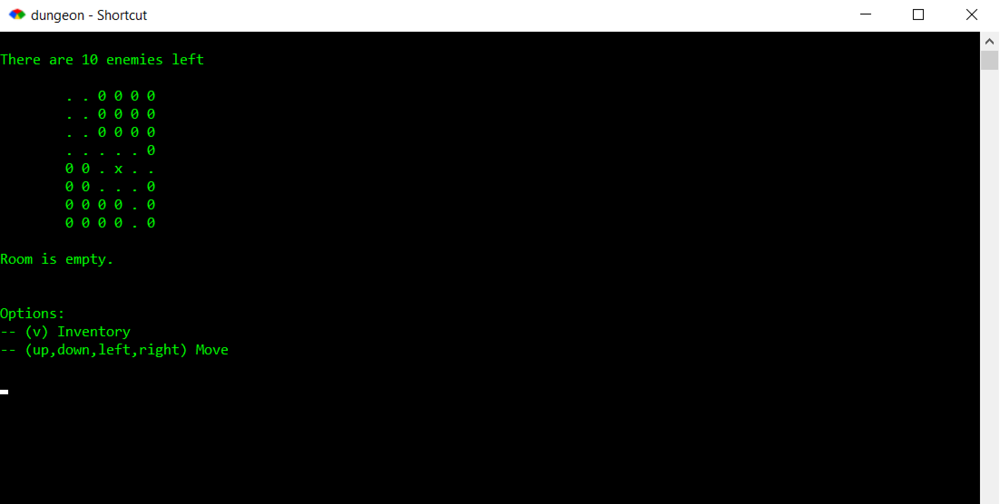

<ul>
<li>Dungeon crawler that runs on the console.</li>
<li>Player chooses their name and how many rooms the dungeon will have(10 <= rooms <= 50).</li>
<li>Dungeon is randomly assembled with rooms and assigned (# of rooms / 2) enemies with random stats.</li>
<li>Rooms are given random items(weapons, health potions, weapon/health buffs).</li>
<li>The player must kill all the enemies to win, or die trying.</li> 
</ul>

  

